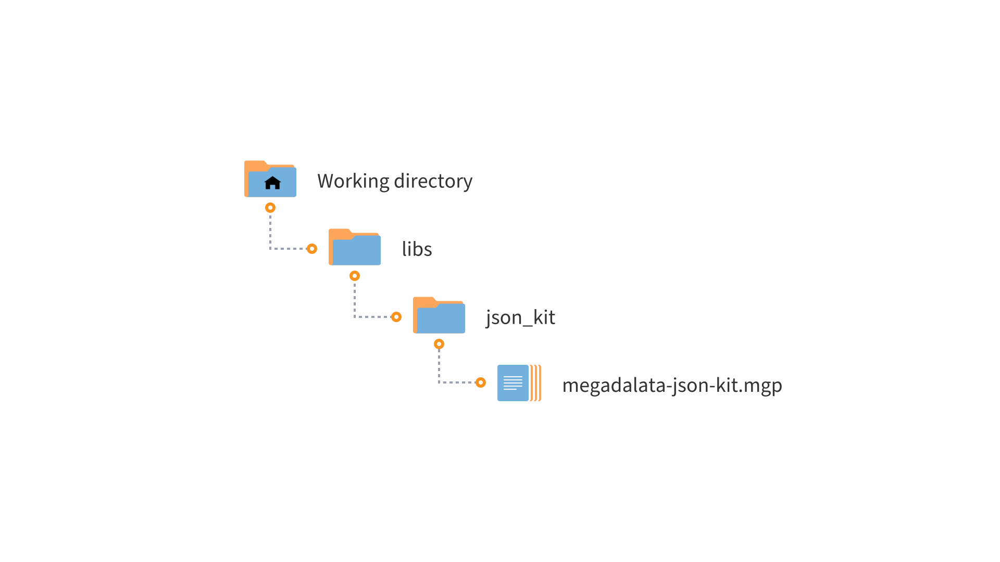

# Megaladata JSON Kit

* Version: 1.0.0
* Tested: All editions of Megaladata 7.1.1

A set of professional components for working with JSON in Megaladata:

* parsing strings in JSON format;
* forming JSON requests from Megaladata datasets.

The components are developed in JavaScript.

## Installation

1. Determine the working directory where your libraries will be located:

   * For server editions - in the working directory of Megaladata Server (in the user folder or in the common users' folder);
   * For desktop editions - in any folder on the local disk.

2. Create a **libs** subdirectory in it.

3. Place the **json_kit** folder in the **libs** directory.

4. Add a link to the **megaladata-json-kit.lgp** package in your package and use the library components.

## Requirements

For the **Megaladata JSON Kit** library to work, you need:

* Installed Megaladata software. Version not lower than 7.1.1

## List of Components

* [Rows to JSON](./docs/rows-to-json.md)
* [Columns to JSON](./docs/cols-to-json.md)
* [Adding Keys](./docs/add-keys.md)
* [JSON Union](./docs/union-json.md)
* [JSON Parsing](./docs/parsing-json.md)
* [JSON Array Items](./docs/array-items.md)
